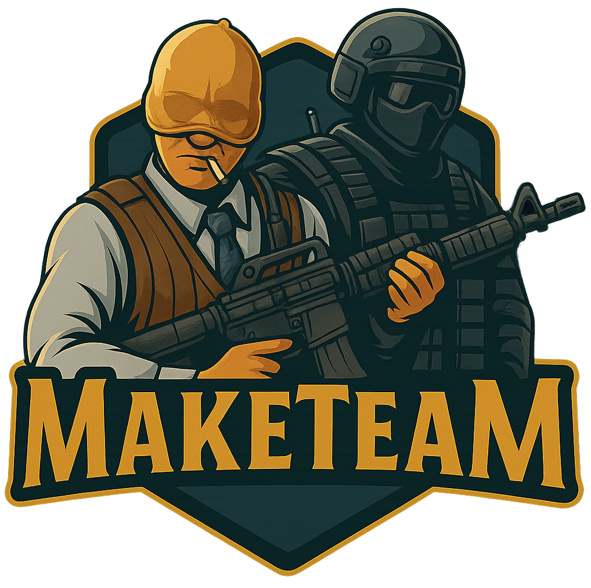

### 🔄 Versão 3.0.1 - 2024-07-15



# MakeTeam Bot - CS2 Discord

## 🔗 Adicionar o bot ao seu servidor
> O MakeTeam atualmente está **hospedado e em funcionamento contínuo** no ambiente de produção (Raspberry Pi 4 + Debian 11) monitorado via Zabbix.

[Clique aqui para convidar o bot](https://discord.com/oauth2/authorize?client_id=1085339903967121480&permissions=16788496&integration_type=0&scope=bot)

Bot para Discord que organiza automaticamente partidas de **Counter-Strike 2**, separando jogadores em equipes e gerenciando canais de voz com comandos simples e diretos.

---

## 🎯 Funcionalidades

- Sorteio automático de equipes (até 5x5 com fila de espera);
- Movimentação automática entre canais de voz;
- Criação e estruturação de canais organizados em uma categoria específica;
- Cria canal de texto para o usuário centralizar os comandos num unico local;
- Comando `!comandos` integrado para exibir as funcionalidades disponíveis;
- Suporte a execução contínua via `systemd` com configuração por `.env`.

---

## 🚀 Comandos

| Comando             | Descrição                                                                 |
|---------------------|---------------------------------------------------------------------------|
| `!make mix1`        | Cria equipes usando os canais `[MIX 1]`                                   |
| `!make mix2`        | Cria equipes usando os canais `[MIX 2]`                                   |
| `!make channels`    | Cria todos os canais necessários organizados na categoria `Counter-Strike 2` |
| `!move mix1`        | Move todos os membros das equipes do MIX 1 de volta para o LOBBY          |
| `!move mix2`        | Move todos os membros das equipes do MIX 2 de volta para o LOBBY          |
| `!comandos`         | Exibe a lista de comandos disponíveis                                     |

> ℹ️ Para que o sorteio funcione corretamente, os jogadores devem estar no canal de LOBBY correspondente:  
> - `!make mix1` → jogadores devem estar no canal **[MIX 1] - LOBBY**  
> - `!make mix2` → jogadores devem estar no canal **[MIX 2] - LOBBY**


---

## 🛠️ Requisitos

- Python 3.8 ou superior

As dependências (`discord.py`, `python-dotenv`) são instaladas automaticamente pelo script `install.sh`.  
**Você não precisa se preocupar com um `requirements.txt`.**

> ✅ Testado com sucesso em ambiente Debian 11 (bullseye) rodando em Raspberry Pi 4 (8 GB, ARMv8 - aarch64)

---

## 📁 Estrutura Recomendada no Discord

```
Categoria: Counter-Strike 2
├─ [MIX 1] - LOBBY
├─ [MIX 1] - EQUIPE 1
├─ [MIX 1] - EQUIPE 2
├─ FILA DE ESPERA
├─ [MIX 2] - LOBBY
├─ [MIX 2] - EQUIPE 1
└─ [MIX 2] - EQUIPE 2

```

---

## 🧠 Instalação Automática

### 1. Configurar o `.env`

Crie ou edite o arquivo `.env`:

```bash
cp .env.example .env
```

Exemplo de conteúdo:

```env
# Caminho do diretório do bot
BOT_DIR=/caminho/absoluto/para/MakeTeam

# Nome do script do bot
BOT_SCRIPT=MakeTeam.py

# Token do seu bot do Discord
DISCORD_BOT_TOKEN=seu_token_aqui
```

---

### 2. Executar o instalador

```bash
chmod +x install.sh
./install.sh
```

Esse script:

- Instala as dependências necessárias com `pip`
- Cria e habilita o serviço `maketeam.service` via systemd
- Inicia o bot automaticamente

---

### 3. Verificar status do bot

```bash
systemctl status maketeam
```

---

### 4. Ver logs do serviço

```bash
journalctl -u maketeam -f
```

---

## 🧹 Desinstalação

Para remover o serviço e parar o bot:

```bash
chmod +x uninstall.sh
./uninstall.sh
```

---

## 👨‍💻 Autor

**Luiz Gustavo Lobo Simões** vulgo **lgl5** 
Gestor de Redes, Eterno prata no CS e entusiasta no mundo dev  
🔗 [LinkedIn](https://www.linkedin.com/in/lgl5)

> 💡 O código Python inicial do MakeTeam foi gerado com apoio do ChatGPT (OpenAI), e posteriormente adaptado, testado e integrado ao ambiente de produção por lgl5.


---

## ⚖️ Licença

MakeTeam © 2025 - lgl5  
Distribuído para fins educacionais e uso comunitário.
